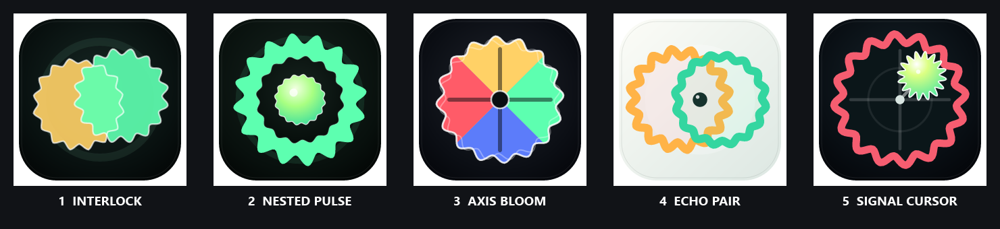
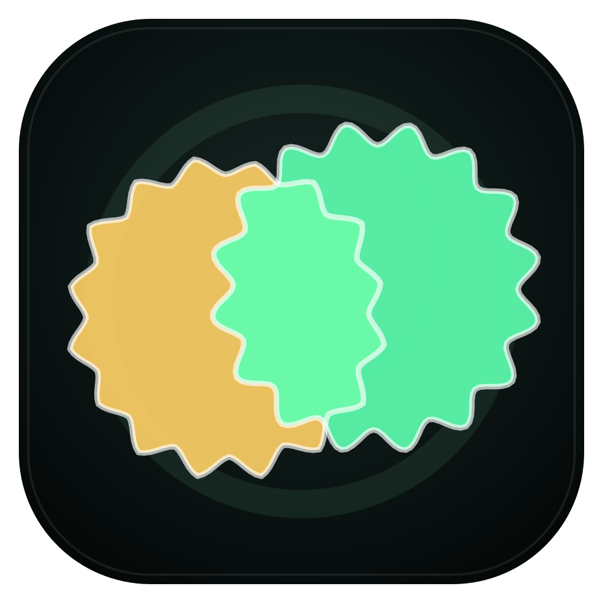
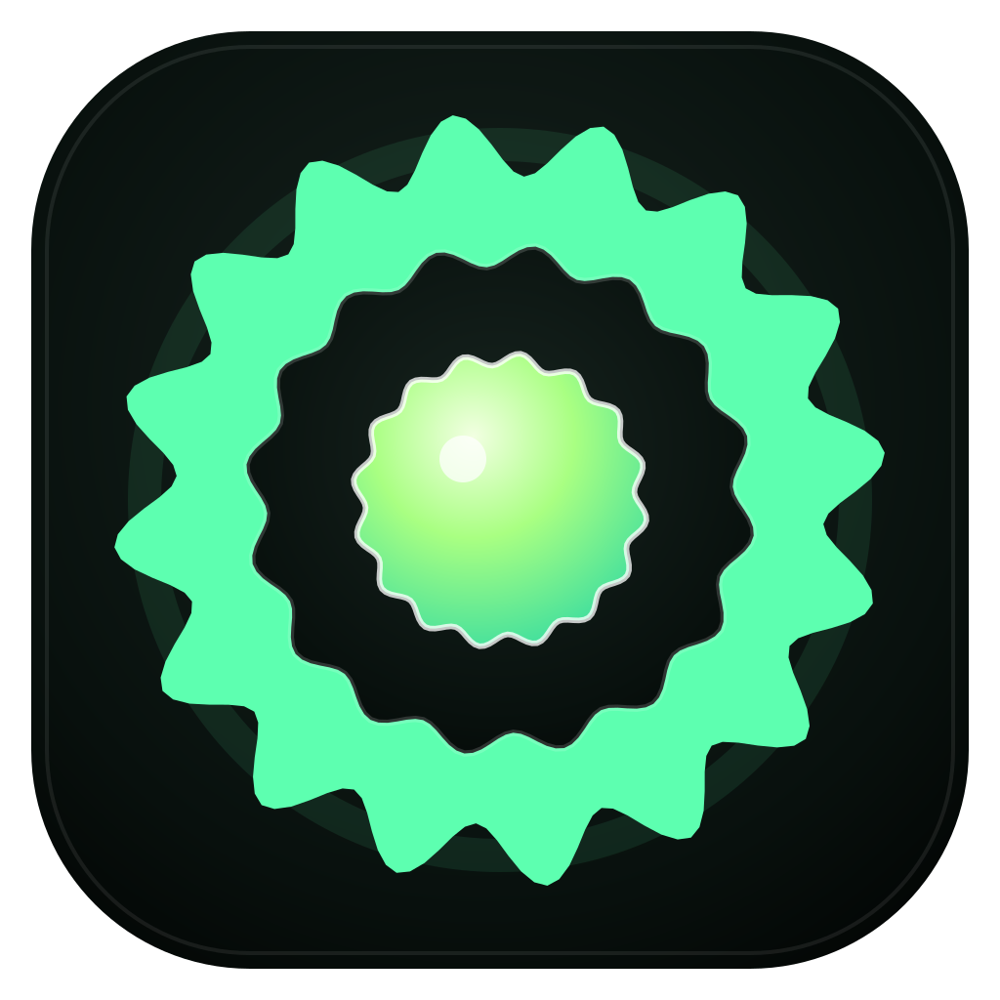
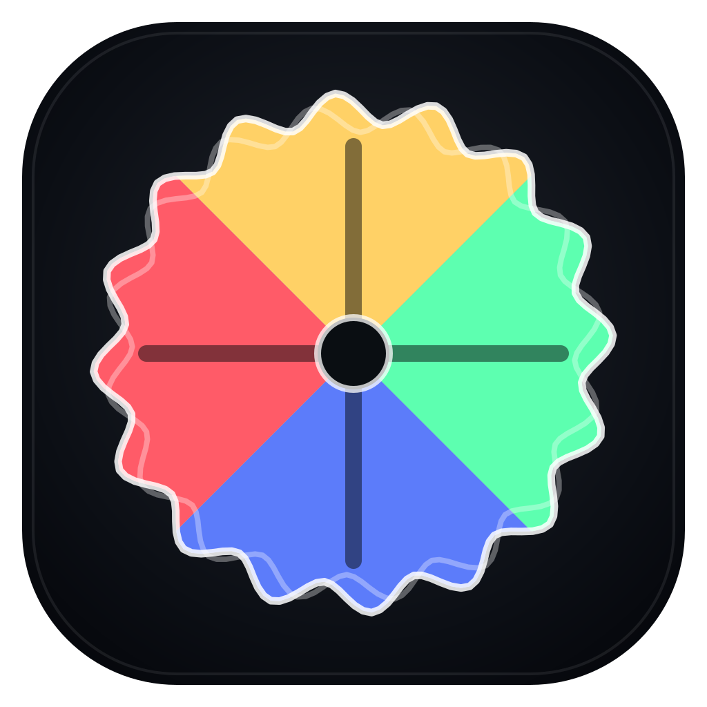
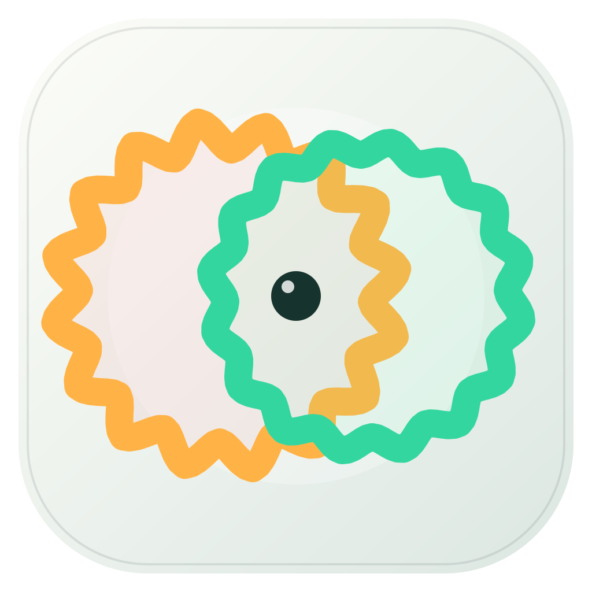
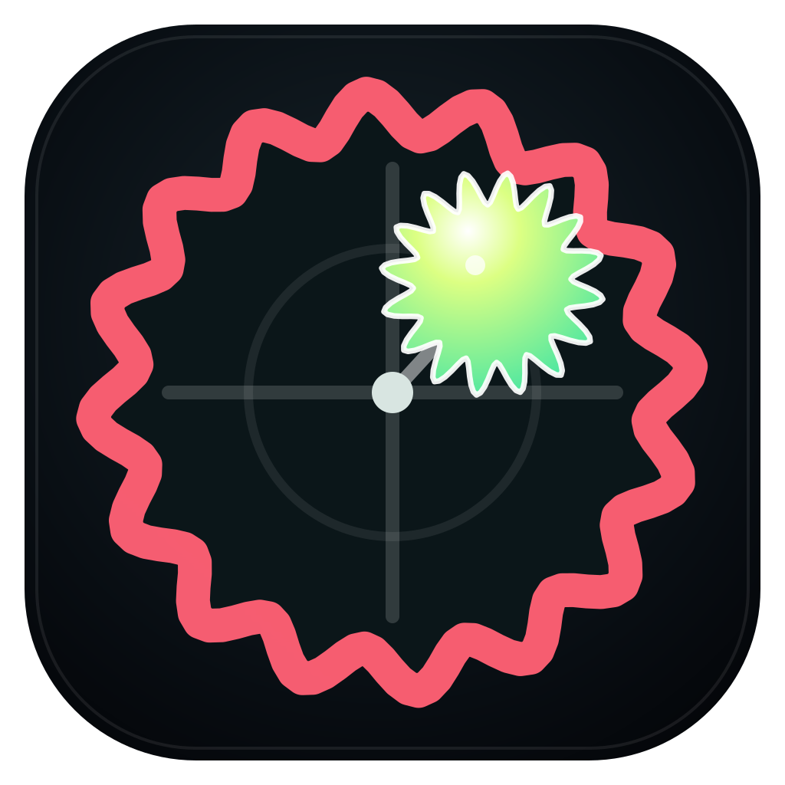

# Affect Research app-logo concepts

These five square SVGs are deterministic compositions of the same 192-point
Flubber geometry used by the application. They use the established affect
palette: arousal up `#ffd166`, arousal down `#5c7cfa`, valence left `#ff5b68`,
and valence right `#5dffb0`.



| Concept | Preview | Design intent |
| --- | --- | --- |
| **01 · Interlock** |  | Two overlapping Flubbers create a bright shared center. This is the closest version of the original “overlay two Flubbers” idea and the strongest general-purpose brand mark. |
| **02 · Nested Pulse** |  | A lively outer state surrounds a calmer tracked core. It stays especially legible at small taskbar and widget sizes. |
| **03 · Axis Bloom** |  | Four directional colors make the valence-arousal model explicit. This is the most research-instrument-specific option. |
| **04 · Echo Pair** |  | Two open traces form a continuous paired signal. The light tile is intentionally distinct from the other candidates. |
| **05 · Signal Cursor** |  | A small live Flubber marks a position inside a larger affect field. This is the most literal “tracker” concept. |

## Rebuild and select

Regenerate the five SVG sources and verify they are current:

```powershell
pnpm desktop:logos:build
pnpm desktop:logos:check
```

List the choices or select one as the packaged application icon:

```powershell
pnpm desktop:logo:select -- --list
pnpm desktop:logo:select -- 01-interlock
```

Selection copies only the named, allowlisted SVG to
`desktop/icons/app-icon.svg`, then regenerates the existing Tauri PNG, ICO, and
ICNS icon set in `src-tauri/icons/`. No package identity, permission, CSP,
research setting, sampling behavior, record, or LSL contract changes.
