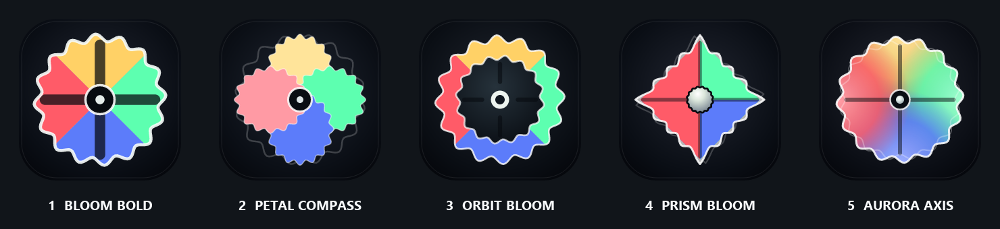
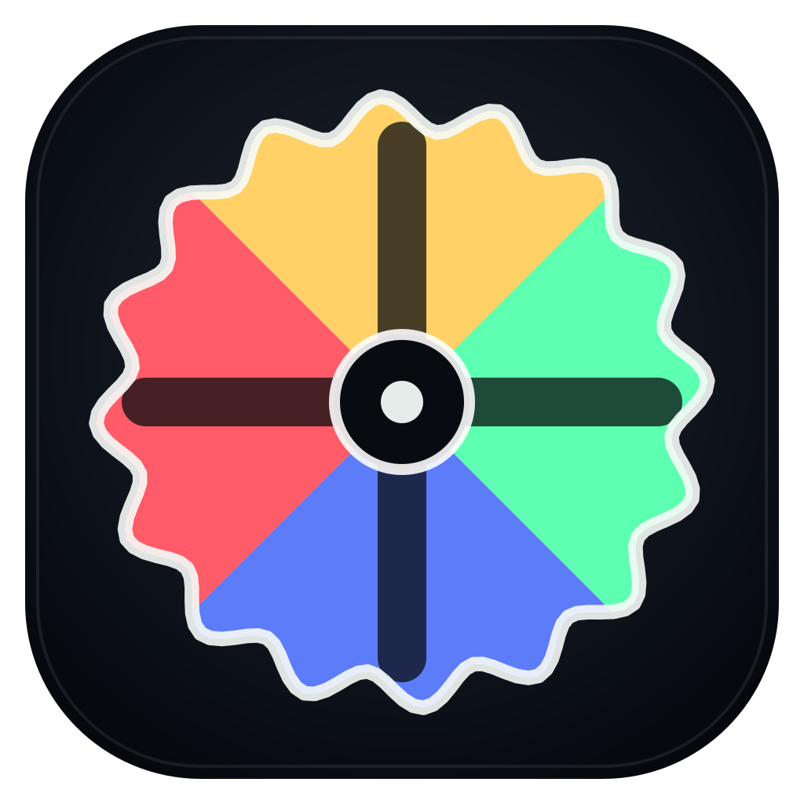
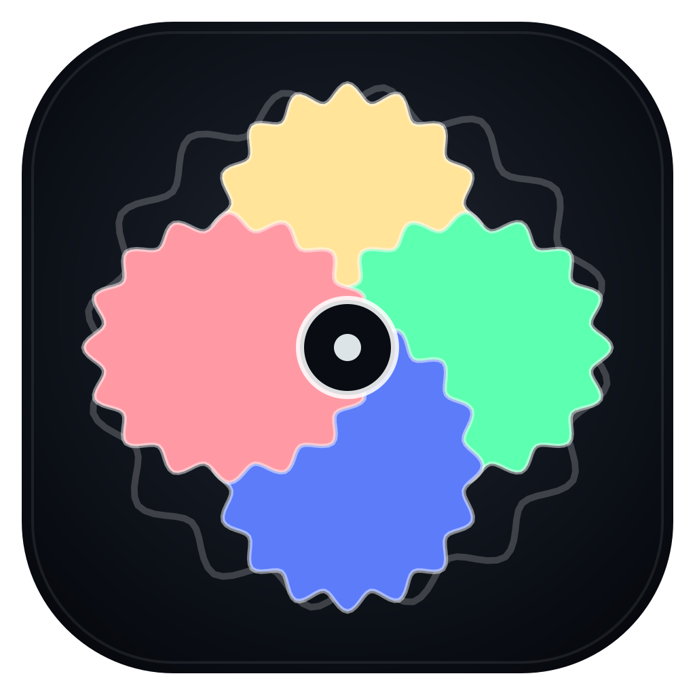
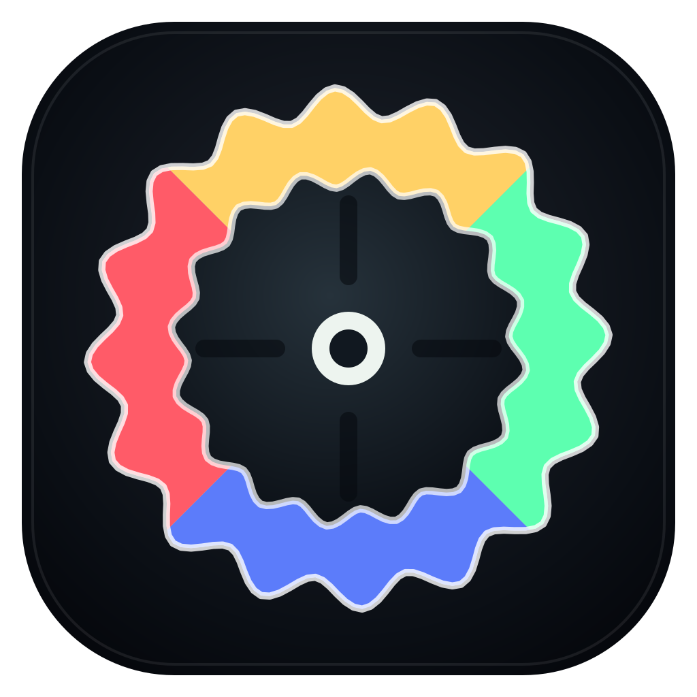
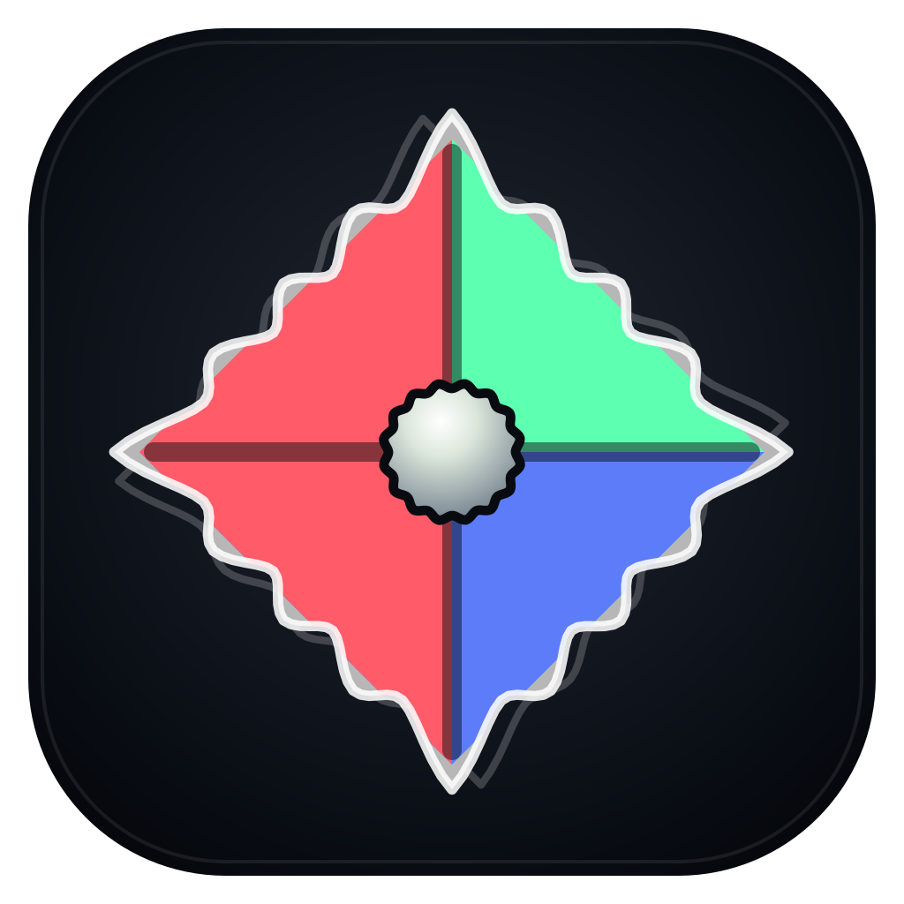
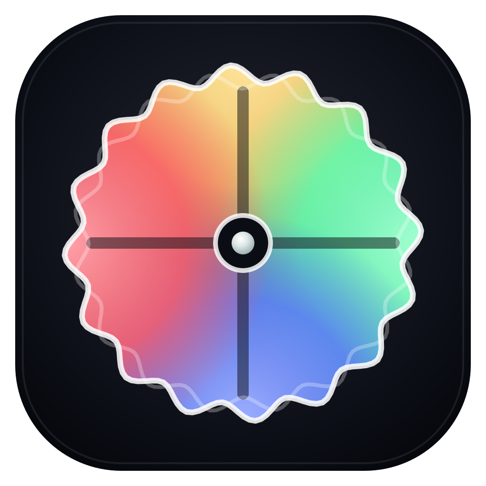

# Axis Bloom variants

These five SVGs are a focused second round based on the selected
[Axis Bloom parent concept](../03-axis-bloom.svg). Every variant keeps the
canonical affect orientation—gold up, mint right, blue down, and coral left—
while changing the geometry and visual emphasis.



| Variant | Preview | Design intent |
| --- | --- | --- |
| **01 · Axis Bloom Bold** |  | The parent concept distilled: heavier negative-space axes, a larger center, and one decisive contour. This is the most faithful refinement. |
| **02 · Petal Compass** |  | Four overlapping Flubbers turn the directional field into a compact organic bloom. |
| **03 · Orbit Bloom** |  | The four affect directions form an outer Flubber ring around a calm tracked state. |
| **04 · Prism Bloom** |  | A Flubber-edged diamond gives the same valence-arousal model a crisper instrument-like silhouette. |
| **05 · Aurora Axis — selected** |  | Four blended directional glows express affect as a continuous field while retaining the axes. This is the project’s canonical app logo. |

## Rebuild and verify

```powershell
pnpm desktop:logos:axis:build
pnpm desktop:logos:axis:check
```

Aurora Axis is copied into `desktop/icons/app-icon.svg` and
`site/assets/app-logo.svg`. Its generated PNG, ICO, and ICNS assets provide the
native application, tray, browser favicon, and link-preview variants.
