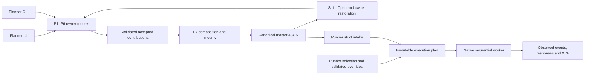

# Planner–Runner design correspondence audit

2026-09-13. Source: `32c7c2d` on `codex/research-unified`, frozen in
`codex/segment-contracts-correspondence-audit`. Stage: Backend Verification;
bounded concern: contracts, P7-03–09 and RR-02/03/05/06/07/10 dependencies.
This report audits software and documentation. It does not qualify a native
session, physical display/timing, device input or actual-session XDF.

The basic design is sound and substantially implemented: complete named owner
contributions, strict independent readers, integrity checks, explicit selection
and a Rust-owned sequential worker. It is not yet a universally self-contained,
editable and executable contract. Four concrete gaps undermine that promise.
The code has useful domain modules, but composition and version policy are still
spread across several authorities.

## Findings, ordered by impact

### A01 — High: a valid master can exceed Planner's editable-owner capacity

The master reader accepts up to 16 MiB. SurveyJS definitions individually allow
4 MiB and P2 permits multiple definitions. The contribution registry separately
limits an entire owner snapshot to 5 MiB. A file can therefore be fully valid
while its complete P2 cannot pass the Planner handoff used for acceptance.

Reproduction: four valid definitions with 1,400,000-character HTML instruction
bodies produce a **5,616,674-byte master** and **5,605,335-byte P2**. Compilation
and `parseSupportedPlannerRecipe` succeed; `validatePlannerContributionSnapshot`
rejects with “Planner contribution exceeds the bounded handoff size.” No network
or real participant content is involved. This demonstrates a software capacity
mismatch, not a physical GUI reopen test.

Sources: [registry limit/validator](../experiment-planner/web/src/research/planner-contributions.js),
[master byte limit](../experiment-planner/web/src/research/planner-recipe-wire.js),
[P2 validation](../experiment-planner/web/src/research/questionnaire-recipe-v2.js),
[Survey definition limit](../experiment-planner/web/src/research/surveyjs-definition.js).

Repair first: define shared, compatible whole-document/segment/definition limits
and enforce them at import, composition, editable restoration and native ingress.
Preserve already accepted documents; do not silently reduce the master reader's
contract. Raising one number without checking CLI/IPC/storage limits is incomplete.
Acceptance: a near-limit multilingual master opens, edits, confirms and saves
through both GUI/CLI owners; over-limit input fails before partial owner mutation.

### A02 — High: SurveyJS resource content is not necessarily self-contained

The full survey object is retained, but `imageLink` can point at an external URL.
The import probe accepts `https://example.invalid/stimulus.png` with no resource
bytes or content digest. Definitions bind the URL string, not the image. The same
JSON can consequently show changed or missing content on another machine or later
date. Hashing the questionnaire JSON does not solve that dependency.

Sources: [inspection policy](../experiment-planner/web/src/research/surveyjs-engine.js),
[import/hash](../experiment-planner/web/src/research/surveyjs-definition.js),
[documented remote-resource allowance](surveyjs-questionnaires.md).

The current allowance is documented; this finding is its mismatch with the
user's stronger self-contained-design requirement, not an undisclosed network
request observed during this audit. Sanitization is a separate concern.

Repair: inventory resource-bearing SurveyJS properties and sanitized HTML, then
choose an explicit supported resource policy. Inline questionnaire resources
meet strict self-containment; external assets need declared identities, hashes,
resolution and preflight equivalent to P1. Preserve imported historical JSON and
surface missing requirements; do not silently remove content or narrow an old
reader. Version any new resource contract. Acceptance includes offline reopen,
missing/changed resources and a fresh machine with no source questionnaire file.

### A03 — High: SurveyJS/master4 cannot use the current runnable validation path

Reader, plan and normal Start/Action v4 dispatch exist. Local validation Start,
however, explicitly accepts only master3 in both JS and Rust. Normal native
research Start remains gated by unavailable playback qualification. Thus the
newest producer format is interpretable but has no presently enabled execution
path in this build. This blocks actual SurveyJS correspondence verification.

Reproduction: the real master4 fixture resolves successfully, then
`NativeMasterProtocolAdapter.start(..., {validation:true})` rejects with
“Validation sessions require master3.” No native invocation occurs.

Sources: [adapter](../experiment-runner/src/master-protocol.js),
[native preflight](../native/src/research_runner_master/commands.rs),
[native Start](../native/src/research_runner_master/runtime.rs),
[qualification state](../native/src/research_native_media/capability.rs).

Repair: extend the approved validation-session contract to supported master4
with permanent unqualified attempt/information labels and matching independent
reconstruction. Preserve all actual media/input/recording checks. Do not flip
research qualification flags. Test producer version × reader × plan × preflight
× Start × responses × information reconstruction as one compatibility matrix.

### A04 — High requirement gap: Runner controller overrides are drafts only

`controller-settings.js` stores an in-memory `override`; applying a changed
setting causes both session checking and Start to reject. Native Start still
passes the recipe's `prepared.feedback.input` to `prepare_run_full`. No effective
override hash or executable session override is established by the editor.
The current implementation fails explicitly, which avoids silently running the
wrong controls, but does not deliver the requested override behavior.

Sources: [controller editor](../experiment-runner/src/controller-settings.js),
[Start/check guards](../experiment-runner/src/app.js),
[native input preparation](../native/src/research_runner_master/runtime.rs).
Also, the editor exposes `InputBindingV1.stepSize`, which is inactive under P5 v2;
the effective step comes from `response.grid`. Reusing this draft as a complete
override implementation would create another conflicting parameter authority.

Repair: a typed Runner session override, applied after strict recipe parsing and
before final plan/input preparation. Freeze original recipe hash, requested
override, effective binding hash and actual input-test receipt into attempt and
information records. Define exactly which fields may change. Native authority
must validate both the override and fresh test against the effective binding.
Recovery must reject mismatched effective settings when master recovery exists.
The original recipe stays byte-identical; no generic JSON patching or deep merge.

### A05 — Medium: documentation combines incompatible generations as current

The mandatory input corpus was approximately 1.25 MB of Markdown, including a
398 KB coordination board. Reading all of it exposed contradictory instructions:

| Earlier assertion | Verified current interpretation |
| --- | --- |
| One executable / two applets; only package-v1 is complete | Separate programs; master versions 1–4 plus a separate legacy package reader |
| Planner completion current priority; Runner deferred | Baseline Planner receipt exists; correspondence is allocated under69/72 |
| P3 stores repeating participant allocation | Its exact marker is `runnerAssigned`; Runner owns selection/defaults |
| CLI mock not yet production-executed | The later69 receipt records its actual 55-step pass |
| Reopen always needs media before any re-export | Unchanged-source copying is supported separately from new accepted compilation |
| Current source is the master-v3 worktree | Git at audit time had converged on canonical `codex/research-unified` |

Old package privacy/marker policies also coexist with typed demographics and the
new information stream. Retain old rules for their exact generation; do not apply
them as blanket bans to explicitly approved successors. Historical check counts
are source-specific receipts, not universal current completion certificates.

This pass replaced `00`/`66` with current maps, and the later repository-hygiene
cleanup removed their copied historical backups from the active tree. Git
history is the archive for the old text. The current router replaces the global
read-every-receipt rule with ordered core plus relevant owner routes. Product
decisions, strict legacy readers and qualification gates are preserved.

## Additional boundaries requiring correspondence coverage

- Mixed historical and controlled P1 media proofs are intentionally rejected by
  [Runner attestation](../experiment-runner/src/master-media.js), pending native location
  mapping. A valid catalogue does not imply executable compatibility. Existing
  focused tests reproduce this refusal; it is not a silently dropped field.
- P5 saves axis/corner labels, but `runnerMasterFeedbackState` does not project
  them and the current Runner surface has no equivalent label renderer.
  Planner draws labels through its own DOM controls. Classify these fields
  explicitly as authoring annotations or participant presentation requirements;
  do not claim complete visible correspondence from full JSON preservation.
- SurveyJS browser rendering creates a live model, while native validation
  creates a new model at its own evaluation clock. The seed is shared and native
  records the clock. Time-sensitive expressions therefore need a focused
  displayed-versus-validated boundary test; a common execution-clock policy is
  not established by the recorded native timestamp. No failure is claimed here.
- Master recovery is explicitly unavailable. Keeping partial files and source
  hashes is not a resumable session implementation.
- The JS Runner plan is only shallow-frozen: its root is frozen, but `steps`,
  individual steps and `selector` remain mutable (confirmed by the probe).
  Native Start revalidates independently, so this is not a native-authority
  bypass. Deep-freeze the published projection to prevent accidental preview/
  parity drift within the frontend after plan creation.

## Structural assessment and simpler target

The segment map should be a dependency graph, not an append-only construction
log. P4/P6 need P1 media and P5 bounds; file restoration already orders those
owners appropriately. The executable sequence is a different ordered object,
derived from P2 hooks and the selected P3 variant.



Keep four clear layers:

1. **Owner models:** one definition of each setting, its validation, dependency
   revisions, complete contribution and editable restoration. UI/CLI are adapters.
2. **Recipe compiler/reader:** exact version dispatch, cross-owner validation,
   integrity and immutable prepared content. No UI, device or filesystem state.
3. **Session compiler:** validated recipe plus explicit session choices becomes
   one immutable effective plan. Device readiness is a separate bound receipt.
4. **Native worker:** consumes the prepared plan, records actual transitions and
   failures, and never reads Planner controls or reinterprets owner defaults.

Much of this already exists. The remaining structural work is concentration of
composition policy, not replacement of every module:

- `experiment-planner/web/src/research/app.js` has 6,578 lines at the audit base and still owns
  feedback restoration, workspace publication, questionnaire restoration,
  version dispatch, file workflow and legacy runtime integration. Extract those
  owner compositions behind existing APIs, one owner at a time. A smaller shell
  should wire dependencies and lifecycle rather than implement domain transforms.
- Version mappings recur in Planner compilation/capture, Runner intake/start/
  actions, native supported types and media routing. Introduce one explicit
  supported-version descriptor per runtime, checked against shared conformance
  fixtures, including capability availability. Do not collapse independent native
  validation into trust of a frontend descriptor.
- JavaScript selection calls `verifyRecipe` again, which prepares every owner
  and reproduces the entire variant/language/presentation matrix. Native
  `PreparedMaster::read` similarly parses then reconstructs. Preserve a private,
  immutable verified-document handle for repeated projections, keyed by complete
  source hash; keep fresh device/media validation separate. Benchmark the maximum
  supported matrix before optimizing. This audit establishes repeated work in
  source, not a measured production performance defect.
- Rust/JS both assemble forms and video/ISI steps. Their independent checks are
  valuable. Maintain a shared golden plan matrix rather than another handwritten
  chronology or another authoritative JSON copy. Fail parity on the first
  differing field/occurrence.
- Keep legacy readers and historical records in an explicit compatibility lane.
  Their existence is not clutter; mixing their active composition with current
  authoring is. Avoid new version wrappers or modules that merely forward a call
  without owning validation, adaptation or lifecycle.

## Verification and scope

Reproduce the audit with:

```powershell
node scripts/qualification/planner-runner-contract-audit.mjs
```

The retained [probe receipt](planner-runner-contract-audit.receipt.json) contains
four master generations, six variant/language selections each, exact canonical
byte round trips, preserved assets/feedback/policy/occurrence order, and rejection
of missing P2 and stale integrity. It also records A01/A02/A03 counterexamples.
No questionnaire source file, actual media or network fetch is needed by these
probes beyond their checked-in synthetic recipe fixtures.

The three checks comprising `surveyjs:check` passed when invoked directly with
Node. The environment's pnpm wrapper tried dependency installation and aborted
before removal; no install/purge override was used. The existing dependencies
were reused through a local ignored worktree junction.

Existing focused tests: **66 passed, zero failed**, using Node's test runner with
concurrency2 and these files under `test/`: `research-planner-recipe.test.js`,
`research-planner-recipe-v2.test.js`, `research-planner-recipe-v3.test.js`,
`research-planner-recipe-publication.test.js`, `research-planner-recipe-file.test.js`,
`research-runner-master.test.js`, `research-runner-master-v2.test.js`,
`research-runner-master-v3.test.js`, `research-runner-master-media.test.js`,
`research-surveyjs.test.js`. These include independent JS-process reproduction,
stale/cancelled/partial restoration, persistence acknowledgements, plan parity
guards, typed answers and SurveyJS behavior.

Rust was inspected; no Rust test/build, foreground app control, new native
session or XDF recording was performed. Existing unrelated source changes were
preserved in the canonical checkout; no running distribution was replaced.

Next implementation order: align editable capacity; complete survey resource
policy; enable master4 validation through the approved labelled contract;
implement typed controller overrides; then extract owner composition while
running the same saved-file and execution-plan matrix. Treat each as a bounded
change with its own evidence, rather than one large rewrite.
