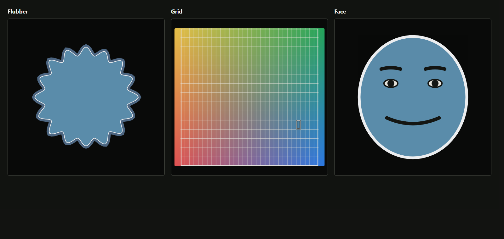

# Master5 display choices: frontend visual receipt

On 2026-10-04, the focused headless Chrome check ran against the current `planner-recipe-v5.canonical.json` fixture and the production `runnerMasterFeedbackState` and `createResearchPreview` functions. The script varied only `segments.P5.presentation.renderer` and rendered Flubber, grid, and face in studio preview surfaces. All 13 assertions passed: the saved renderer reached the projected state, exactly that renderer was visible, the Flubber path and face expression were drawn, and the 1584 × 665 CSS pixel viewport had no horizontal overflow.



Reproduce on Windows with Chrome:

```powershell
node scripts/qualification/runner-display-modes-ui.mjs 'C:\Program Files\Google\Chrome\Application\chrome.exe' 'C:\path\to\new-output-directory'
```

This is a synthetic frontend component projection. It does not prove that an installed Runner opened the JSON, played media, recorded samples or streams, wrote XDF, maintained timing, or completed a participant workflow. Those gates remain open.
