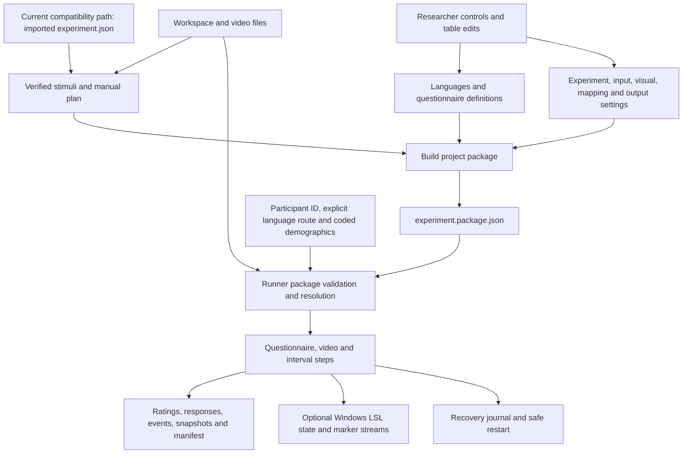

# Implementation audit and source evidence

This is the detailed current-state audit supporting the [central segment roadmap](60-SEGMENT-CATALOGUE.md). It retains the original S1–S8 UI IDs, file/data flow, redundancy candidates and findings; use the roadmap’s P1–P7/R1 IDs for future capability work. This audit does not override the researcher’s final-state requirements.

**Source baseline:** integrated commit `305d3ac6b2de40a27436f7c97cb1ee2d2a2e87ce`, audited 2026-09-11. Inventory: 420 tracked files, 43 Research JavaScript modules, 36 Rust source files, 48 JavaScript test files. Source presence is distinct from runtime or research qualification. Builds, installed applications, private workspaces and remote deployment were not inspected as current runtime evidence.

Unchecked review boxes here are audit/researcher review items, not the authoritative capability completion checklist. Maintain completion status in `60-SEGMENT-CATALOGUE.md`, qualification receipts in `40-ROADMAP.md`, and claim gates in `30-TESTING-AND-RELEASE.md`.

## Overall data flow in the audited implementation

The accordions are a review order, not a strict chain where section 2 consumes
all of section 1 and section 3 consumes all of section 2. They contribute to a
shared, validated design. Workspace and verified video identities feed several
sections; questionnaires and languages are a parallel input to compilation.



**Designer → Runner handoff:** one canonical JSON file contains the experiment
definition and all embedded questionnaire content. Video bytes remain separate
under `assets/stimuli/`; the package identifies and hashes them. The JSON alone
does not carry the movies, participant responses, or platform qualification.
The current Designer's manual-plan editing gap is described in S3/S4 below.

## Designer: eight current Setup segments

### S1 — `workspace` — Workspace & Libraries

- **Purpose/function:** choose the local work directory and expose the video
  library and finished package location. Current controls are Set work directory,
  Manage videos, Load JSON, native Explorer actions, and browser access renewal.
- **Input ← researcher/platform:** chosen directory; optionally an existing
  canonical `experiment.package.json`; native workspace capability or browser
  File System Access permission.
- **Output → other segments:** workspace identity/handle, readiness/status,
  library access for S2/S3, output/recovery destinations for S8/Runner, and a
  parsed package receipt when loaded. It creates no participant data itself.
- **Saved structure:** package root and fixed asset/output/recovery directories;
  native paths stay behind opaque IDs. Browser initialization also retains
  legacy root `stimuli/` and `settings/` directories and a workspace identity
  file. These are implementation details, not additional package authorities.
- **Current limit:** browser import still writes root `stimuli/`, while package
  validation reads `assets/stimuli/` (F02). Loading a package also locks the
  current language/questionnaire editor; a complete editable reopen workflow
  is not established by the presence of Load JSON.
- **Sources:** [workspace section](../site/src/research/ui-view.js),
  [browser workspace](../site/src/research/workspace.js),
  [Rust workspace](../src-tauri/src/research_workspace.rs).
- [ ] **Review S1:** confirm folder selection, file placement and load/reopen behavior.

### S2 — `questionnaires` — Languages & Study Assets

- **Purpose/function:** author pre-video questionnaires in one accordion/table
  per requested family and selected language. Supports blank forms, MAIA-2,
  TAS-20 preparation slots, item editing, rectangular paste, row changes,
  required flags, option count, labels/codes, Undo, preview, import and save.
- **Input ← researcher/S1:** selected languages; questionnaire title/instructions,
  item prompts and required flags; visible option labels; numeric codes;
  explicit CSV/TXT/JSON source, simple item/code table file or focused table
  paste; workspace storage access.
  The picker lists EN/DE/FR/ES/IT/PT/NL/PL/JA/ZH; that is not ten-language
  instrument availability. Initial authoring selection is English.
- **Output → package compiler:** accepted `QuestionnaireDefinitionV1[]`,
  `QuestionnaireModuleV2[]`, exact family×language coverage, and terminal
  language/module lists. New modules use `beforeSession`; updating an existing
  definition preserves all referencing modules' hook placements and hashes.
- **Saved structure:** definition includes `questionnaireId`, version, title,
  language, instructions, attribution, source receipt, ordered `items[]` and
  `definitionSha256`. Each item has ID/order/prompt/required/subscale and
  ordered options `{optionId, order, label, scoreValue}`. Original authoring
  bytes are content-addressed under
  `assets/questionnaires/<family>/<language>/<sha256>.<format>`.
- **Current limits:** a response selects one option per item; code is the
  existing nullable `scoreValue`, not another response field. MAIA EN/DE can
  preload; TAS content must be supplied. Dirty/busy/invalid sheets block
  compilation. Label repetition 1/5/10 is preview-only; the current finalizer
  additionally requires it reset to 1 before building. Unsaved draft durability
  and editing an already loaded package need review. Simple table files and
  strict full-definition interchange use distinct import paths (F04).
- **Sources:** [editor](../site/src/research/questionnaire-editor.js),
  [sheet model](../site/src/research/questionnaire-sheet.js),
  [format adapters](../site/src/research/questionnaire-authoring.js),
  [coverage](../site/src/research/questionnaire-assets.js),
  [definition/response contracts](../site/src/research/questionnaires.js).
- [ ] **Review S2:** confirm content, languages, coding, save behavior and preview limits.

### S3 — `stimuli` — Experiment Plan & Stimuli

- **Purpose/function:** import/discover complete videos, inspect declared blocks,
  verify media, preview each participant's exact video/ISI order, and export
  `resolved-plan.csv`. A separate inspiration dialog supplies source links.
- **Input ← S1/researcher/S4:** files or folders; imported embedded experiment
  definition; explicit stimulus IDs, blocks, participant schedules and
  `isiAfterMs`; observed hash, length, duration and decode result.
- **Output → compiler/S8:** matched stimulus registry, `ResolvedExperimentPlanV1`,
  ordered participant slots, media readiness, plan hash, and CSV schedule view.
  Array order is preserved; this segment does not allocate or randomize.
- **Saved structure:** package `assets.stimuli[]` has
  `{stimulusId,title,relativePath,mimeType,sha256,byteLength,durationMs}`.
  Embedded plan has `stimuli[]`, `blocks[]`, and
  `schedules[].blocks[].videos[{stimulusId,isiAfterMs}]`.
- **Current limits:** the integrated UI explicitly says it does not edit order.
  Every registered block occurs once per participant, a participant cannot
  repeat a stimulus, and every registered stimulus must be used. Authoring a
  video/block/participant order through the UI remains pending. File extension
  recognition is not codec qualification. Browser placement mismatch: F02.
- **Sources:** [current section](../site/src/research/ui-view.js),
  [manual plan reader/resolver](../site/src/research/external-experiment.js),
  [native catalogue adapter](../site/src/research/native-media-catalogue.js),
  [schedule export columns](../site/src/research/tabular.js).
- [ ] **Review S3:** confirm manual-plan controls and per-occurrence ISI requirements.

### S4 — `experiment` — Experiment

- **Purpose/function:** show experiment identity and participant count; edit the
  acquisition rate. Houses compatibility load/template actions for
  `experiment.json` and load/save actions for legacy settings.
- **Input ← imported plan/researcher:** experiment ID/title/schedules plus an
  integer sampling frequency from 1–240 Hz. The UI initially suggests 130 Hz.
- **Output → compiler:** `settings.experiment`
  `{id,title,participantCount,samplingFrequencyHz}` plus the embedded
  `settings.externalProtocol` definition and source/definition hashes.
- **Current limits:** ID, title and participant count are `readonly`; UI help
  tells the researcher to edit/reload `experiment.json`. `researchSettingsFromUi`
  requires an experiment document. A loaded package can supply that embedded
  document, but from-scratch UI design is incomplete. Continuous rating is
  always on; there is no global ISI or summary-only acquisition setting.
- **Sources:** [experiment markup](../site/src/research/ui-view.js),
  [settings assembly](../site/src/research/app.js),
  [V3 settings](../site/src/research/external-protocol.js).
- [ ] **Review S4:** decide the desired editable identity/participant workflow.

### S5 — `input` — Controller / Input Device

- **Purpose/function:** select/capture a conflict-free binding and exercise it
  in an inert input test. Nine presets cover keyboard layouts, pointer Grid,
  mouse buttons/wheel, gamepad D-pad and left/right sticks.
- **Input ← researcher/device:** preset or captured physical action for each
  direction; saved digital step size; pointer/axis configuration; focus/device
  availability. Saved step size is currently beside the live preview.
- **Output → compiler/Runner:** `InputBindingV1`
  `{schema,version,preset,kind,stepSize,directions,axes}`; normalized input-test
  state; on native, a one-use binding/device-bound test receipt.
- **Current limits:** digital Run input is edge-only and ignores OS repeat;
  analog/pointer step size is N/A. Native service availability gates presets.
  Preview Continuous/Stepwise/hold controls do not amend these Run semantics.
  Hardware, focus, DPI, disconnect and latency qualification remain open.
- **Sources:** [browser input](../site/src/research/input-controller.js),
  [binding contract](../site/src/research/contracts.js),
  [Rust input](../src-tauri/src/research_input.rs),
  [XInput adapter](../src-tauri/src/research_gamepad.rs).
- [ ] **Review S5:** confirm actual saved input behavior separately from preview behavior.

### S6 — `visual` — Visual Feedback

- **Purpose/function:** configure saved Grid/Flubber appearance and normalized
  overlay placement. The accordion currently routes to controls beside the
  persistent preview rather than containing the full appearance form.
- **Input ← researcher/S5:** Grid/Flubber visibility, size, transparency,
  feedback hiding, position/lock, outline/halo/Grid/cursor geometry, eight
  colors; transient x/y for showing the result.
- **Output → compiler/renderer:** `settings.visual` with `gridEnabled`,
  `flubberEnabled`, `sizePercent`, `transparency`, `hideFeedback`,
  `overlayPosition:{x,y}`, `lockPosition`, `flubber`, `grid`, `colors`.
- **Current limits:** Run forces placement locked and hiding feedback does not
  stop sampling. Face choice, halo-width draft and tile/hold simulator settings
  are absent from this object. Saved controls and preview-only controls share
  screen space and should be reviewed for clear distinction.
- **Sources:** [UI assembly](../site/src/research/app.js),
  [preview renderer](../site/src/research/preview.js),
  [visual contract](../site/src/research/contracts.js).
- [ ] **Review S6:** confirm which appearance controls belong in the saved experiment.

### S7 — `advanced` — Advanced

- **Purpose/function:** configure optional outbound LSL and six affect mappings.
  LSL stays in this accordion; its feedback-settings action routes to mappings
  beside the preview.
- **Input ← researcher/affect state:** enable/stream/type/source names; mapping
  minimum, maximum, driver (`x-axis`, `y-axis`, `angle`, `radius`) and reverse.
- **Output → compiler/renderer/LSL:** `settings.advanced.lsl`
  `{enabled,stateStream,streamType,markerStream,sourceId}` and
  `settings.advanced.mappings` with `oscillationFrequency`, `edgeSmoothness`,
  `projectionAmplitude`, `pulseSynchrony`, `waveSizeVariation`, `saturation`.
  Every mapping has `{min,max,drivenBy,reverse}`.
- **Current limits:** mapping values are derived from one coordinate snapshot.
  Browser preserves imported LSL configuration but blocks Start if enabled.
  LSL streams are not an in-app XDF/“LSL file” output.
- **Sources:** [mapping math](../site/src/research/mappings.js),
  [Advanced markup](../site/src/research/ui-view.js),
  [Rust LSL](../src-tauri/src/research_lsl.rs).
- [ ] **Review S7:** confirm mapping ranges and intended stream/file responsibilities.

### S8 — `review` — Review & Start

- **Purpose/function:** build the finished package, inspect preflight, choose a
  participant/attempt and explicit language path, derive coded demographics,
  select output formats during design, then request Start or recovery.
- **Input ← S1–S7/researcher:** accepted design, verified media and storage,
  input receipt, participant ID, rerun/resume choice, language option-ID path,
  transient names/age/gender/handedness, CSV/TSV choice and playback capability.
- **Output → disk:** Build project package compiles and writes
  `experiment.package.json`. `settings.output` is exactly `{csv:boolean,
  tsv:boolean}`, at least one true, governing both rating and response tables.
- **Output → Runner:** frozen canonical package, derived settings/plan/protocol
  and hashes, asset bindings, selected language path, coded participant
  `{participantCode,age,gender,handedness}`, attempt reservation and runtime
  receipts. Raw names are erased before the Start request; Rust's type named
  `TransientParticipant` contains coded fields plus participant ID, not names.
- **Current limits:** Designer completion and Runner intake share this Setup
  flow; they are not separate executables. Native package save acknowledgement
  is not awaited by the UI finalizer (F03). Native package Start requires
  GstPlay and remains blocked before mutation; the displayed unqualified
  playback selector cannot make a package runnable (F06).
- **Sources:** [Review markup](../site/src/research/ui-view.js),
  [finalizer/Start assembly](../site/src/research/app.js),
  [native requests](../site/src/research/native-package-protocol.js),
  [native runtime](../src-tauri/src/research_native_protocol/runtime.rs).
- [ ] **Review S8:** confirm final design export, participant intake and Runner handoff.

## Shared presentation segments

| ID | Main function and input | Output and current boundary |
| --- | --- | --- |
| `accordion` | Eight section definitions plus open/confirm actions | Open section ID and session-local reviewed-ID set; visible receipt, focus progression and reversible motion. No package, preflight or persistent output. Confirming the last section leaves none open. |
| `preview` | Saved appearance/mapping projection plus transient x/y and design controls | Flubber/Grid/procedural Face display, contour halo, directional color editor and Continuous/Stepwise simulator. Odd tile count is 3–2001. Face/tile/timing/hold/halo-width drafts are not saved or instantiated as Run configuration. |

Sources: [accordion transitions](../site/src/research/ui-contracts.js),
[motion](../site/src/research/setup-accordion-motion.js),
[renderer](../site/src/research/preview.js),
[response simulator](../site/src/research/preview-response-simulator.js),
[tiles](../site/src/research/preview-tiles.js),
[procedural face](../site/src/research/responsive-face.js),
[geometry baseline](../site/src/math.js).

- [ ] **Review accordion:** confirm that Reviewed means manually reviewed, not valid or saved.
- [ ] **Review preview:** decide which draft controls, if any, should become versioned Run settings.

## The final JSON: what reconstructs the experiment

The sole new-attempt definition is **`ExperimentPackageV1`**, saved as
**`experiment.package.json`**. It is canonical UTF-8 without BOM, with one
trailing LF. Unknown/missing fields and invalid hashes reject. The following
is a field map, not a hand-editing template.

| JSON path | Information carried | Producer → consumer |
| --- | --- | --- |
| `schema`, `version` | `affect-research-experiment-package`, integer `1` | Compiler → strict reader |
| `packageId` | Bounded package identity; UI currently derives `<experiment-id>-package` | S4/finalizer → package/run receipts |
| `assetRoot` | Exactly `assets/stimuli` | Compiler → asset verifier |
| `assets.stimuli[]` | Exact declared video ID/title/path/MIME/hash/length/duration | S3 → closed-tree verification/media binding |
| `languageSelection` | `algorithmVersion`, `rootNodeId`, `nodes[]`, `languages[]`; ordered prompt/options and terminal module lists | S2/finalizer → participant language traversal |
| `playback` | `complete-video-v1`, start at 0, decoded end, rate 1, no loop/seek, Pause allowed, unmuted volume 1, adjacent feedback, restart from beginning | Compiler's explicit policy → media/recovery |
| `settings.schema`, `settings.version` | `affect-research-settings`, integer `3` | Compiler → mirrored settings reader |
| `settings.experiment` | Identity/title/count/sample frequency | S4 → scheduler and attempt identity |
| `settings.stimuli.items[]` | Logical verified stimulus registry | S3 → assignment/media projection |
| `settings.externalProtocol` | `external-order-v1`, source/definition hashes, complete embedded manual experiment definition | S3/S4 → ordered assignments |
| `settings.questionnaires` | Algorithm, complete definitions, modules with exact hooks/targets | S2 → protocol resolver and response validator |
| `settings.input` | Complete binding, direction/axis actions and step semantics | S5 → input authority |
| `settings.visual` | Grid/Flubber appearance, geometry, colors and placement | S6 → Run feedback projection |
| `settings.advanced` | Six mappings plus LSL configuration | S7 → affect projection and Windows outlets |
| `settings.output` | CSV and TSV booleans | S8 → both kinds of response/rating tables |
| `integrity` | Algorithm plus definition/settings/assets/experiment-plan/protocol-matrix hashes | Compiler → independent validation |

**Path distinction:** embedded historical settings/plan use logical paths such
as `stimuli/video.mp4`; the package manifest uses `assets/stimuli/video.mp4`.
`assetBindings` explicitly joins `{stimulusId,logicalPath,packagePath,sha256,
byteLength,durationMs}`. That logical translation does not move an imported file.

**Questionnaire nesting:** a definition owns wording and scores; a module owns
where it is administered. Modules have `{schema,version,moduleId,questionnaireId,
definitionSha256,placement}`. Placement owns `kind`, `blockId`, `stimulusId`,
`relativeToIsi`, with irrelevant members explicitly null. A terminal language
owns its ordered `questionnaireModuleIds`; language tags alone never select or
reorder forms. Current new authoring builds a flat language tree; readers can
accept existing valid nested trees.

**Hash distinction:** `integrity.packageDefinitionSha256` hashes the canonical
root with all of `integrity` omitted. The separate receipt
`canonicalSourceByteSha256` hashes the entire saved file including integrity
and LF. `integrity.settingsSha256` covers the complete package settings;
selected-language settings receive their own derived hash. Likewise, the
aggregate experiment-plan/protocol-matrix hashes do not replace an individual
participant's `assignmentSha256` or participant/language protocol hash.

**Not included:** movies; raw names or completed demographics; questionnaire
answers and ratings; workspace absolute paths/permissions; attempt IDs/time;
input-test or decoder/platform qualification receipts; Reviewed marks;
unsaved editor drafts; preview-only Face/tile/hold/label-layout settings.
Questionnaire source-library files need not be reopened to reconstruct a form:
the full definition is embedded in the JSON.

Executable references: [JavaScript package reader/compiler](../site/src/research/experiment-package.js),
[Rust mirror](../src-tauri/src/research_experiment_package.rs),
[canonical fixture](../test/fixtures/experiment-package-v1.canonical.json).
The fixture is conformance data with synthetic media bytes; it is not a usable
study or a guarantee of complete questionnaire-language coverage for a new design.

- [ ] **Review package:** confirm that this contains all intended runnable design choices.

## Runner: reconstruction and execution segments

| ID | Purpose / input received | Output produced / next consumer | Current state |
| --- | --- | --- | --- |
| `runner-intake` | Canonical package bytes from Designer, authorized asset tree, participant ID and explicit terminal option-ID path | Compiled selection: language-specific settings/hash, experiment plan, participant assignment/hash, flat protocol plan/hash, asset bindings; feeds preflight | Browser and Rust compilers present. No locale, RNG, clock or prior storage supplies missing design fields. |
| `runner-start` | Compiled selection, coded demographics, input receipt, live storage/media/platform gates and attempt choice | Create-new attempt, immutable snapshots, lock/reservation, start receipt and active step | Browser implementation present. Native implementation present but public package Start requires qualified GstPlay; capability currently blocks it. |
| `runner-questionnaire` | Frozen definition and module/step identity; participant option selections and response latency | Durable draft; on submit, validated response rows and completion event plus safe step advance | Single choice. Labels/codes derive from the frozen definition, not submitted scores. Unanswered optional items omit rows. No rating sampling or regular LSL state during forms. |
| `runner-video` | Current stimulus and verified media binding, playback policy, input and appearance configuration | Playback lifecycle/status, affect-state samples while playing, events; advances to the next protocol step after decoded end | Pause/Stop paths present. Native actor source exists; installed media/input/timing qualification remains open. |
| `runner-interval` | Previous video's explicit `isiAfterMs` and ordered pre/post-ISI hooks | Neutral timed interval; start/completion events; next step | Every video has an interval, including final and zero-duration intervals. No rating acquisition; interrupted interval restarts its full duration. |
| `runner-finish` | Completed sequence or Stop Early, durable rows/events and frozen receipts | Complete or Partial manifest, tables/snapshots, output receipt, lock release and Setup return | Retry/recovery logic present. Completion is not claimed until durable finalization. |

Reconstruction order is: before-session modules; for each manually ordered
block, before-block modules, each video → pre-ISI after-video modules → that
video's interval → post-ISI after-video modules, then after-block modules;
finally after-session modules. Hook wire token `afterStimulus` means “after
video”. Questionnaire ordering comes from the selected terminal's explicit
module list, constrained by each hook's position.

Sources: [browser run controller](../site/src/research/run-controller.js),
[browser adapter](../site/src/research/runtime-bridge.js),
[protocol resolver](../site/src/research/external-protocol.js),
[native compiler](../src-tauri/src/research_native_protocol/compiler.rs),
[native reducer](../src-tauri/src/research_native_protocol/reducer.rs),
[native responses](../src-tauri/src/research_native_protocol/responses.rs),
[native coordinator](../src-tauri/src/research_native_protocol/runtime.rs).

- [ ] **Review runner-intake/start:** confirm package reconstruction and participant intake.
- [ ] **Review runner-questionnaire:** confirm form behavior and missing-response semantics.
- [ ] **Review runner-video/interval:** confirm playback, hooks, Pause, timing and restart behavior.
- [ ] **Review runner-finish:** confirm complete, partial and output receipt behavior.

## Shared execution services

| ID | Main function | Input ← producer | Output → consumer / limitation |
| --- | --- | --- | --- |
| `contracts` | Strict validation and deterministic serialization | Untrusted settings/packages/records/IPC; complete typed values | Validated immutable objects, canonical bytes, hashes or rejection. Historical versions retain meanings. |
| `asset-verification` | Verify declared file closure and separate decode readiness | Package asset manifest + selected workspace files + decoder observations | Exact asset bindings, bounded media grants and readiness errors → compiler/Start/media. A scan never silently enrolls assets. |
| `participant` | Derive code and reconstruct attempt state | Transient form → frontend code derivation; locks/journals/manifests → state audit | Code/age/closed gender/handedness plus Available/Active/Partial/Complete → Start/chooser. No raw-name persistence. |
| `affect-state` | Convert accepted input into bounded VA state and mappings | Frozen binding, accepted edges or pointer/stick state | Current/target x/y, radius/angle, six mapped values, active flags → renderer/sampler/LSL. Native input mailbox bounds digital FIFO and coalesces continuous state observably. |
| `media` | Own prepare/play/pause/end/error and resource teardown | Opaque verified asset grant, viewport, typed lifecycle actions | Media state/position/decode receipts → run authority. Windows actor owns GstPlay/child HWND; browser video owns browser lifecycle. |
| `timing` | Sample only active playback on a monotonic schedule | Explicit 1–240 Hz, active segment, timestamped affect/media state | `ResearchSampleV1` rows and explicit missed-deadline events → writer/LSL. No animation-clock sampling or backfill. |
| `recording` | Persist typed evidence and project selected formats | Samples, events, questionnaire responses, frozen package/plan/participant context | Journal, CSV/TSV, JSON snapshots and manifest → filesystem/audit. Browser commits IndexedDB before materialization; Rust owns files. |
| `recovery` | Validate durable evidence and restart safely or finish pending output | Frozen package/hash bindings, valid journal and current workspace | Recovery choices, restored draft or restarted video/interval, finalize-only receipt; corrupt evidence is quarantined. No mid-video/partial-ISI resume. |
| `lsl` | Publish Windows outbound state and semantic markers | Frozen LSL settings, canonical sample/event stream | Eight Float32 state channels at configured rate + irregular marker stream → independent receiver. No questionnaire prompts/answers, raw names or file paths; no XDF writer. |
| `platform-bridge` | Compose one browser/native owner and project typed operations/status | Setup/Run requests and owner results | Validated UI projections, errors and receipts. Native paths/handles stay in Rust. Browser adapters own browser-specific storage/input/media. |

The LSL channel order is `current_valence`, `current_arousal`,
`target_valence`, `target_arousal`, `radius`, `angle_degrees`,
`animation_active`, `input_active`.

- [ ] **Review contracts/assets/participant:** accept ownership and validation boundaries.
- [ ] **Review affect-state/media/timing:** accept who owns state, playback and sampling.
- [ ] **Review recording/recovery/LSL/bridge:** accept persistence, recovery and external outputs.

## Generated files and their meaning

The design package lives at the package root. Each attempt uses
`outputs/<experiment-id>/<participant-id>/<session-stem>/`; the stem contains
participant ID, derived code, age, gender, handedness, timestamp and attempt
counter. Runtime data is not written back into the design package.

| Artifact | Information generated | Current owner / use |
| --- | --- | --- |
| Root `experiment.package.json` | Finished reusable design, all run-defining parameters and self-hash | Designer compiler + workspace writer → Runner |
| `assets/stimuli/<file>` | Separate complete video bytes, matched to declared digest/length/duration | Import/storage → verified media; browser import gap F02 |
| `assets/questionnaires/<family>/<language>/<hash>.<format>` | Original questionnaire authoring/provenance bytes | S2 storage; embedded definition is Run authority |
| Exported `resolved-plan.csv` | Participant, block and video order, per-video ISI, media identity and plan hashes | S3 schedule projection; not a second editable run authority |
| Attempt `experiment.package.json` | Exact frozen canonical input bytes | Mandatory package snapshot; ManifestV4 `experimentPackage` output |
| `settings.snapshot.json` | Frozen selected-language settings | Derived attempt snapshot |
| `experiment.json` | Embedded canonical experiment definition materialized for evidence | Derived from package, not a second Run input |
| `experiment-plan.snapshot.json` | Resolved experiment/participant assignments and hashes | Compiler → attempt evidence |
| `protocol-plan.snapshot.json` | Exact participant's ordered questionnaire/video/interval steps and hash | Resolver → execution/recovery evidence |
| `ratings.csv` / `ratings.tsv` | One row per accepted acquisition sample | Selected by package; common 43-column sample contract |
| Browser `questionnaire-responses.csv` / `.tsv` | Answer rows with exact item/option identity, label/code, provenance, status and timing | Selected by package; common 25-column response contract |
| Native `questionnaire.csv` / `.tsv` | Same response record family; different current file naming | Native writer candidate; filename difference F05 |
| `events.jsonl` | Ordered semantic lifecycle/input/timing/write/questionnaire/interval events | Always retained; one JSON record per line |
| `manifest.json` | Completion/partial outcome, hashes, output digests/counts, timing/recovery/build/playback/package receipts | Package attempts finalize as `ResearchRunManifestV4` |
| Native `recovery/<id>.package.jsonl` and partial output files | Durable package-run checkpoints and file-prefix state | Recovery/transaction authority until finalization |
| Browser IndexedDB `affect-research/v1` | Locks, accepted rows/events/responses, draft and finalization state | Browser journal; file materialization can be retried |

Rating columns include run/participant/attempt identity, settings/assignment
hashes, stimulus identity, wall/monotonic/LSL timestamps, cadence/jitter/gap and
anchor-age fields, media time, current/target VA, radius/angle, six mappings,
and input/feedback flags. Questionnaire rows include run/participant/attempt,
settings/assignment/protocol hashes, step/module/definition/item/option
identity, `responseLabel`, nullable `scoreValue`, optional subscale, draft or
submitted status, wall/monotonic time and response latency. Neither table
embeds every package hash in every row; the manifest, snapshots and protocol
bindings provide the package-level evidence chain.

Exact columns: [ratings and schedule](../site/src/research/tabular.js),
[responses](../site/src/research/questionnaires.js). File writers:
[browser](../site/src/research/run-controller.js),
[native](../src-tauri/src/research_native_protocol/storage.rs).

- [ ] **Review outputs:** confirm filenames, columns, missing answers, partials and analysis needs.

## Supporting project segments

| ID | Purpose and input | Output / current scope |
| --- | --- | --- |
| `reference-catalogues` | Curated stimulus/questionnaire metadata, local public reference materials and provenance | Inspiration links, rights/status metadata and public catalogue assets. No automatic media selection or package enrollment. Simplified S2 has no broader questionnaire-catalogue opener; the old dialog, metadata and handlers remain in source/markup. |
| `build-delivery` | Entrypoints, source, locked dependencies, build config and runtime pin | Static Pages closure, Tauri frontend and optional unsigned interface-only native packages plus provenance. Windows research runtime qualification remains open; macOS/Linux builds are Setup evaluation only. |
| `verification-tools` | Fixtures, typed test seams, explicit candidate/runtime input | Node/Rust tests, independent-process reproduction receipts and optional off-screen/worker diagnostics. Diagnostic results are not live-study qualification. |
| `legacy-compatibility` | Historical V1/V2/V3 settings/plans/manifests and explicit imports | Strict historical reading/conversion/recovery. `counterbalancer.js`, `protocol-plan.js`, `youtube-player.js` and legacy native runtime paths remain source; they are not new-package allocation or YouTube authority. |
| `instructions-provenance` | Charter, status, workflow, references and review decisions | `for-ai/`, root instructions, README/notices and this running checklist; not executable settings. |

Sources: [stimulus catalogue](../site/src/research/stimulus-inspiration.js),
[questionnaire metadata](../site/src/research/questionnaire-inspiration.js),
[Pages builder](../scripts/build-research-pages.js),
[artifact guard](../scripts/verify-research-build.js),
[desktop config](../desktop/vite.config.js),
[unsigned packaging](../scripts/build-unqualified-desktop-package.js),
[runtime pin](../src-tauri/native-media/gstreamer-runtime-v1.json),
[independent-instance verifier](../scripts/verify-experiment-package-instance.js).

- [ ] **Review supporting segments:** confirm catalogue, compatibility and delivery boundaries.

## Redundancy and cleanup review, segment by segment

These are **candidates for later review**, not instructions to delete code now.
“Consolidate” means simplify the presentation or owning implementation while
preserving the required behavior. Each row names the potentially redundant
surface and the reason some of it may need to remain.

| Review ID / segment | Repetition or responsibility split observed | Suggested later decision |
| --- | --- | --- |
| D01 / S1 workspace | S1 shows library/package locations, while Manage videos jumps to S3 and compatibility files live in S4 | Keep S1 as one directory owner; decide whether its shortcuts are useful. Avoid a second video importer or package editor here. |
| D02 / S2 questionnaires | New sheet editor coexists with older questionnaire upload/preview/inspiration helpers and dialogs in `app.js`/`ui-view.js`; `questionnaire-file-input` and `questionnaire-sheet-file` both exist | Trace reachable controls after pending S2 integration. Retire unused presentation/helpers if confirmed unreachable; keep canonical definitions and historical readers. |
| D03 / S2 imports | Simple item/code table files, strict full-definition CSV/TXT/JSON, direct edits and paste all populate the editor | Keep distinct input purposes explicit, then converge accepted content at one definition validator. Do not confuse a cell-table export with an export of labels/provenance/full metadata. |
| D04 / S2 languages | Study-language selection and later participant-language choice display similar language lists | Keep both roles: one defines offered languages; the other selects the participant's route. Simplify wording, not their separate authorities. |
| D05 / S3 plan | Video registry, declared blocks, resolved participant preview and resolved-plan CSV repeat plan facts | Keep one editable plan source and derive all previews/exports from it. Review which summaries the researcher actually needs to see simultaneously. |
| D06 / S4 experiment | Identity/count are shown separately from the imported plan that owns them; read-only fields resemble authoring controls | Make identity/count part of an actual UI authoring owner, then decide whether the extra read-only summary is useful. Preserve explicit schedules, not a conflicting count control. |
| D07 / S5 input | Device/binding/test live in S5; saved step size and proposed response dynamics live by the preview | Consider one coherent saved input editor, with a separately labelled simulator. Retain a physical input test because the simulator cannot verify the Run device. |
| D08 / S6 visual | The entire accordion is currently a Go to appearance controls link; the actual editor is by the preview | Decide whether this section should be a review summary/navigation landmark or contain controls. The current eight-section charter must be amended explicitly before removing a section. |
| D09 / S7 advanced | LSL lives here, while six mappings live beside the preview behind another navigation action | Review whether technical stream settings and visual mappings need separate presentation. Keep one saved owner per mapping/color; do not duplicate editable values. |
| D10 / S8 review | Package Build, run preflight, participant details and Start share one section; package intake sits back in S1 | Clarify Designer finish/export versus Runner intake/run readiness within the two existing modes. Building a design should be understandable independently of supplying participant demographics. |
| D11 / accordion | Reviewed marks, validation states, saved-sheet status and Start readiness can all look like completion checks | Keep the meanings separate and reduce repeated status prose. A manual Reviewed click must never replace validation, save success or preflight. |
| D12 / preview | Saved appearance/mapping controls sit beside temporary Face/tile/halo/response controls | Visually group saved versus preview-only choices; evaluate the need for each simulator control. Removing draft controls is not equivalent to removing persisted Run fields. |
| D13 / contracts and bridge | Browser and Rust implement overlapping package/plan/hash validation and several DTO checks | Intentional independent owners for different runtimes. Keep parity fixtures; centralize schema documentation and boundary tests, not native authority in the WebView. |
| D14 / runtime/recovery | New native package runtime coexists with a large historical native runtime; browser controller/journal also handles multiple versions | Isolate compatibility from new-attempt routing and remove only proven unreachable new-run paths. Historical records must remain readable/resumable under their original contracts. |
| D15 / files | Package, settings snapshot, embedded `experiment.json`, resolved experiment plan, protocol plan and manifest repeat some information | Preserve scientific/recovery evidence. Label each file's purpose and authority; the snapshots are derived receipts, not independent settings sources. Do not remove them merely to reduce JSON count. |
| D16 / reference assets | Public stimulus catalogue assets and a researcher's package videos can both look like the “video library”; bundled/retained questionnaire files have different availability | Keep public reference browsing separate from declared package assets and authorized preloads. Review build closure as well as visible controls before removing assets. |
| D17 / documentation | Charter, requirements, architecture, roadmap, checklist and message board repeat status/contract language and have drifted | Keep a concise authority map and link to one status owner. This catalogue should summarize observed flow; avoid copying full normative rules into every file. |
| D18 / verification and delivery | Similar test/build commands appear in Pages checks, desktop checks and manual packaging | Review exact-candidate reuse and whether duplicated jobs test a different platform/feature matrix. Do not remove distinct Rust feature, browser, artifact or qualification gates simply because commands look similar. |

Sources for the UI repetitions are the section builders and dialogs in
[`ui-view.js`](../site/src/research/ui-view.js), event handlers in
[`app.js`](../site/src/research/app.js), and the separate
[`questionnaire-editor.js`](../site/src/research/questionnaire-editor.js).
There is currently an old questionnaire Inspiration dialog and handler, but no
`id="questionnaire-inspiration"` opener in the active section builder. Treat
removal as a reachability check after S2 convergence, not a proven whole-module
dead-code finding.

Coordinator size is another cleanup signal. At this snapshot `app.js` is about
5,330 lines, `native-bridge.js` 2,984, `workspace.js` 2,251,
`browser-journal.js` 3,280, `run-controller.js` 2,046, the native package runtime
2,711, native workspace 3,074, and legacy `research_runtime.rs` 8,595.
These are source-file counts including comments and inline tests, not complexity
scores. Follow the existing authority boundaries when extracting cohesive
pieces; do not split mechanically by line count or combine independent
lifecycles merely to reduce the file count.

- [ ] **Review D01–D06:** decide workspace, questionnaire and plan simplifications.
- [ ] **Review D07–D12:** decide input, visual, Advanced, Review and preview organization.
- [ ] **Review D13–D18:** distinguish required parallel implementations/evidence from removable duplication.

Record a cleanup decision as `Keep / Consolidate / Remove candidate / Defer`,
with the segment ID and reason. A Remove candidate still needs reference/import,
runtime-route, build-closure, historical-record and focused-test checks in the
later implementation pass.

## Findings and proposed follow-up checklist

These are current observations for review. This pass makes no application fix.

For workflow cleanup, review **F01–F03 and F06 first**: they affect authoring,
asset placement, save completion or the available Start path. **F04/F05/F07**
are interface/format decisions, **F08** is documentation drift, and **F09/F10**
are outstanding product/qualification work. An unchecked item is not necessarily
a confirmed defect; the description states its evidence and limits.

- [ ] **F01 — Complete UI authoring and editable reopen.** S3/S4 remain
  import/read-only and loading/building a package locks the language editor.
  Decide the full create → save → reopen → revise workflow. Existing scope:
  [Designer completion](45-FUTURE-AGENT-CHECKLIST.md#designer-completion-and-other-sections).
- [ ] **F02 — Align browser video import with the package asset root.**
  `BrowserResearchWorkspace.importVideoFiles` writes `this.#directory("stimuli")`;
  `verifyExperimentPackageAssetClosure` checks `packageStimuliDirectory`
  (`assets/stimuli`). `app.js` calls the former for import. Therefore an import
  alone does not place that movie where package verification expects it.
  Preserve historical reading and fix the active authoring handoff in its owner.
- [ ] **F03 — Bind native package completion to successful disk save.**
  `generateExperimentPackage` applies/locks the parsed package and announces
  generation after dispatching the save event; the bridge queues and awaits
  the native writer separately. A listener accepting the event is not save
  completion. Review cancellation/failure/retry and retain an editable design
  until the exact write receipt is confirmed. Source trace; no GUI failure
  injection was performed in this audit.
- [ ] **F04 — Clarify the two questionnaire file-import routes.**
  Download table template emits `Item,Code 1,...`. The current sheet Import
  file **does accept this table**, strips the recognized header and applies
  its cells; JSON or a `format_version` header routes to the strict complete
  definition importer. The simple table carries prompts/codes, not all labels,
  metadata and provenance. Standardized full-definition templates also exist
  under `site/questionnaires/`. Review naming, format detection and preservation
  of slot metadata; do not describe the simple table as a complete-definition
  export. This is an interface/contract clarification, not a broken-table-import
  finding.
- [ ] **F05 — Decide response filename parity.** Browser writes
  `questionnaire-responses.csv/tsv`; native package storage constants write
  `questionnaire.csv/tsv`. Both expose response output kinds. Document or align
  the external analysis interface with explicit compatibility handling.
- [ ] **F06 — Make the native playback selector's package limit clear.** Review
  offers `unqualifiedWebview`, but `PackageProtocolRuntime::start` requires
  `NativeGstPlay`; native qualification currently blocks Start. Do not present
  the legacy fallback as a way to run a new package. This is a UI/runtime scope
  mismatch, not permission to enable an alternate backend.
- [ ] **F07 — Review preview-to-package expectations.** Label repetition
  5/10 currently blocks Build until reset to 1, while Face/tile/timing/hold/halo
  drafts stay outside package serialization. Decide whether to retain this
  authoring UX and which future settings need a new version. Existing scope:
  [future questionnaire/Runner work](45-FUTURE-AGENT-CHECKLIST.md#questionnaires-language-and-future-runner-work).
- [ ] **F08 — Reconcile stale brief wording against current source.**
  `10-PRODUCT-REQUIREMENTS.md` still discusses reserving package evidence in
  ManifestV3; the charter and current writers use ManifestV4. Some architecture
  loader text describes an earlier incomplete slice; current package parser
  and compilers enforce canonical bytes and recompute derived hashes.
  Metadata still labels `research/video-protocol-v1` the active implementation
  branch; this snapshot is the unified integration branch. Update through the
  documentation owner without weakening version/qualification distinctions.
- [ ] **F09 — Review remaining participant/output product choices.** Fixed
  demographics and navigation localization, omitted optional-response rows,
  exact custom coding during real acquisition, and LSL receiver/file ownership
  remain open in the existing future-work checklist. S2 coverage is not full
  participant-interface language coverage.
- [ ] **F10 — Complete qualification separately.** Native actor/FFI audit,
  safe installed DLL bootstrap, redistribution/source closure, decoded full-app
  two-instance reproduction, physical input, 30-minute timing, storage adversity,
  accessibility and independent LSL receiver evidence remain open. Automated
  conformance and a package hash do not close them.

## Source coverage index

Additional source review during central-roadmap preparation confirmed the
LSL reconstruction gap: native package `event_marker` emits only
`event:<eventType>`, and `LslService::push_marker` obtains its timestamp when
pushing. Video/variant/occurrence identities from richer local event records
are not carried in that marker payload. The roadmap tracks the intended
replacement contract at P3-06/P3-07 and deferred runtime work at R1-04/R1-06;
existing outlet tests do not close these items.

This index accounts for every Research JS module and Rust source file in the
snapshot. Grouping means functional coverage, not a line-by-line security audit.
Some owners span several catalogue IDs; source files are not additional modes.
All filenames in the JS column are under `site/src/research/`; Rust filenames
are under `src-tauri/src/` unless a different root is stated.

| Functional owner | JavaScript source modules | Rust source modules |
| --- | --- | --- |
| Shell, modes, presentation and platform composition | `app.js`, `ui-view.js`, `ui-contracts.js`, `ui-bootstrap.js`, `browser-entry.js`, `native-entry.js`, `native-bridge.js`, `runtime-bridge.js` | `main.rs`, `lib.rs`, `research_commands.rs`, `research_error.rs`, `research_platform.rs` |
| Package, canonical contracts and manual protocol | `canonical.js`, `contracts.js`, `experiment-package.js`, `external-experiment.js`, `external-protocol.js` | `research_contracts.rs`, `research_experiment_package.rs`, `research_external_protocol.rs`, `research_protocol.rs`, `research_native_protocol/compiler.rs`, `research_native_protocol/contracts.rs` |
| Workspace, assets and storage capability | `workspace.js`, `storage-capability.js`, `native-media-catalogue.js` | `research_workspace.rs` |
| Questionnaires | `questionnaires.js`, `questionnaire-authoring.js`, `questionnaire-assets.js`, `questionnaire-editor.js`, `questionnaire-sheet.js`, `questionnaire-storage-request.js` | `research_native_protocol/responses.rs` (shared definition types in `research_protocol.rs`) |
| Participant and input | `identity.js`, `input-controller.js` | `research_participant.rs`, `research_input.rs`, `research_gamepad.rs`, `research_native_protocol/input_mailbox.rs` |
| Visual, mappings and transient preview | `mappings.js`, `preview.js`, `preview-response-simulator.js`, `preview-tiles.js`, `responsive-face.js`, `setup-accordion-motion.js`; geometry in `site/src/math.js` | Mapping/state types and evaluation in `research_contracts.rs` |
| Native media adapters and lifecycle | `native-media-controller.js`, `native-run-media.js` | `research_native_media.rs`, `research_native_media/capability.rs`, `research_native_media/contracts.rs`, `research_native_media/state.rs`, `research_native_media/gst_actor.rs`, `research_native_media/gst_actor/runtime_environment.rs`, `research_native_media/gst_actor/windows_renderer.rs` |
| Run, timing, persistence, recovery and LSL | `native-package-protocol.js`, `run-controller.js`, `sampling-worker.js`, `browser-journal.js`, `protocol-records.js`, `tabular.js` | `research_native_protocol.rs`, `research_native_protocol/commands.rs`, `research_native_protocol/reducer.rs`, `research_native_protocol/runtime.rs`, `research_native_protocol/records.rs`, `research_native_protocol/storage.rs`, `research_native_protocol/recovery.rs`, `research_clock.rs`, `research_timing.rs`, `research_lsl.rs` |
| Historical compatibility | `counterbalancer.js`, `protocol-plan.js`, `youtube-player.js` | `research_runtime.rs`, `research_run_storage.rs` |
| Inspiration metadata | `questionnaire-inspiration.js`, `stimulus-inspiration.js` | No separate native authority |

Remaining tracked families were inventoried as entrypoints/styles/icons,
questionnaire and public stimulus assets/provenance, package/Cargo/pnpm locks,
Tauri/build/capability files, CI workflows, scripts/qualification helpers,
tests/fixtures, and documentation/licensing. Logo scripts and static catalogue
preparation scripts generate development/publication artifacts; they do not
participate in experiment reconstruction.

## Audit evidence and branch boundaries

- Source/field trace covered both entrypoints, eight section builders, settings
  assembly, questionnaire normalization/save/coverage, package creation/load,
  selected route compilation, browser/native Start, native media capability,
  responses and both file writers, recovery/record contracts and build gates.
- Executed the canonical fixture through the actual JS parser and selected
  participant compiler. Observed all nine package root keys, actual nested
  field shapes, and explicit ordered video/questionnaire/interval steps.
- **59/59 existing focused tests passed**, Node `v24.19.0`, exit code 0:

  ```powershell
  node --test --test-reporter=dot test/research-experiment-package.test.js test/research-questionnaire-authoring.test.js test/research-questionnaire-sheet.test.js test/research-questionnaire-integration.test.js test/research-external-runtime.test.js test/research-questionnaire-runtime.test.js test/research-native-package-protocol.test.js test/research-modular-architecture.test.js
  ```

  This includes package independent-process conformance and selected runtime
  test seams. It does not execute Rust, native hardware or a full GUI workflow.
- Earlier documentation pass verified its local links, source coverage and whitespace. The central roadmap installation has its own documentation verification receipt in the message board.
- No fresh full Node/Rust matrix, production build, installed app, browser UI,
  timing/LSL/hardware, physical asset decoding, remote CI or deployment gate was
  run: this pass changes documentation only and claims source/contract coverage.
  Prior pass counts in the roadmap/message board are historical receipts.
- Pending work is not described as integrated behavior: S2 commit `59d15d9`
  (`codex/segment-questionnaires-table-catalogue`) adds spreadsheet-grid/prebuilt
  changes; S3 `codex/segment-stimuli-order-table` had uncommitted order/workbook
  and native source additions when observed. Neither is included in this
  snapshot. Re-audit affected rows after the integration owner collects them.
- The integration branch moved during initial reading. The final audit was
  anchored in an isolated worktree at `305d3ac`; that commit's message board
  contains no conflict markers. Earlier observed markers were already resolved
  by integration and are not an outstanding finding here.
- This detailed audit was extracted from the original catalogue when `60-SEGMENT-CATALOGUE.md` became the central final-state roadmap. Its source baseline remains unchanged; documentation installation does not qualify or integrate pending application work.
